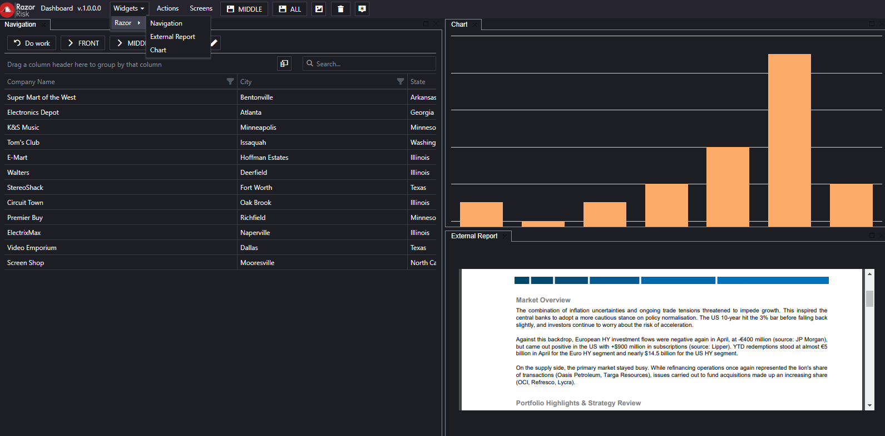

# GLDashboard

A framework build upon AngularJS and [Golden Layout](https://github.com/golden-layout/golden-layout) to create dashboard like apps (widget discovery, multiple layout persistance, workspace customization, themes...). Tighly coupled to DevExtrem controls.

Check the demo for the implementation details.

# 
